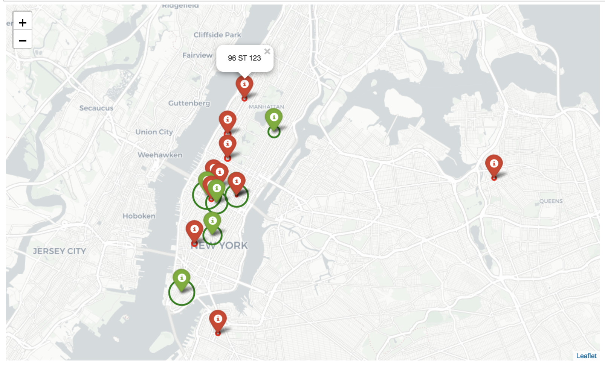
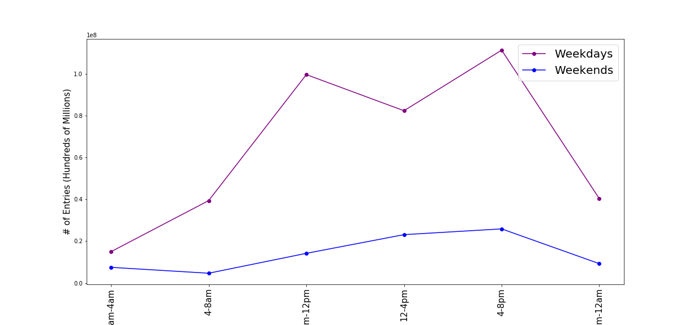
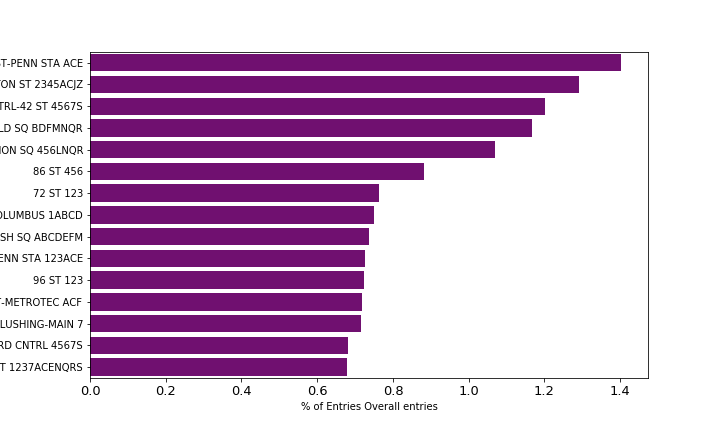

# [MTA](http://www.mta.info/) Traffic Analysis for a client. 

# Table of Contents
[1. Project Overview](#section-a)  
[2. Actions](#section-b)  
[3. Results](#section-c)  
[4. Summary of insights](#section-d)  

---

## 1.  Project Overview
The goal of our project was to provide actionable data that will help optimize the placement of WTWY Organizations street teams, such that they can gather the most signatures, ideally from those who will attend the event and contribute to their cause.
---

## 2.  Actions
Used MTA Turnstyle Data for April 2015-2017 (http://web.mta.info/developers/turnstile.html)
 
1. Identified stations with highest traffic volume
 
2. Executed Time Analysis
 
3. Identified Individual stations with highest potential for awareness and fundraising
 
4. Identified stations with highest traffic volume

5. Identified Individual stations with highest potential for awareness and fundraising

### Tools Used: Python, Pandas, Matplotlib, Seaborn, Folium, ZipCode API

---

## 3.  Results

### Location Recommendation

1. Recommended loations in green. 

2. Traffic recieved at each station is proportional to the circle around the point. 

### Day of the Week Recommendation:

### Top 15 Recommendations:

### Time/Hour Recommendation:

## 4.  Summary of insights
1. Top 15 Stations (3%) cover 13.5% of foot traffic
2. Stations near Universities and Tech hubs present opportunity for  outreach and awareness. 
3. Stations classified as high per capita income present opportunities for fundraising. 
4. Weekdays mornings not recommended.
5. Overall stations are better targeted between 4-8pm
