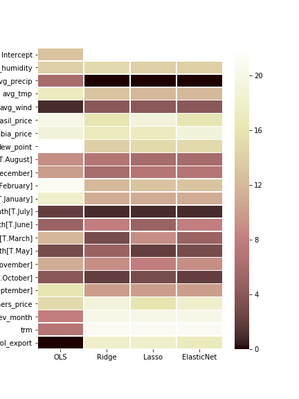

# Colombian Coffee Production Analysis and Prediction. 

# Table of Contents
[1. Project Overview](#section-a)  
[2. Actions](#section-b)  
[3. Results](#section-c)  
[4. Repository Structure](#section-d)
[5. Sources](#section-e)

---

## 1.  Project Overview
Colombia is the second Coffee productor country in the world.  Only 3% of the country produces 10% of the coffee consumed all over the globe.
The purpose of this Project is to analize and detrmine what are those facvtors than influence high coffee production to ensure Production for future Months.
For that we will analyze several types of information:
- Weather Data: Weather conditions and particular month of harvest can influence the growing of the crops
- Competitor Countries: Brazil is the biggest coffeee productor, Vietnam has similar Production volume and other countries, might affect the production
- Economical Factors: Most of the Coffee Produced in the cpuntry is exported, can exporting volumnes (Demand) influence?  Also, since Colombia doesn't use the traditional market currency (dollar), the change rate between dollar and Colombian Perso should be analyzed as well
---

## 2.  Actions 
1. Extract Data from sources

1.1 Weather Data was scraped using [Scrapy](https://scrapy.org) from Weather Underground webpage [www.wunderground.com] for the three most important cities close to the coffee plantation areas in Colombia
 
1.2. Coffee Production Data fom Colombia, as well as Exporting Volumes and Dollar Change rate were downloaded in csv format from [Colombian Coffee Growers Organization](www.federaciondecafeteros.org) webpage
 
1.3. Economical and Coffee Production information from other countries were gathered from the [International Coffee Organization](www.ico.org) webpage
 
2. General EDA analysis for all variables

3. Country and Economical Analysis

4. Time Series Analysis

5. Regularization of all models and generation of a final Model

### Tools Used: Python, Pandas, Matplotlib, Seaborn, statsmodels, sklearn

---

## 3.  Results

### Location Recommendation

Coffee Production, instead of was was believed in the beginning of this analysis, doesn't seem to be affected by **weather conditions**.  Coffee will grow in any temperature and humidity % inside the area of observations.  Although protection against **rain** MUST be preserved.  Precipitations seem to be the only weather significant factor

Economical facts from **international competidors** such as Brazil, Vietnam, Peru and Mexico, don't seem to affect either.  The production of these countries, along with Colombia, seem to be influenced **all in paralell** by other external features in common not included in this analysis.

Month of Harvest seem to be **the most important feature** in Coffee Production.  Periods of **May until August** as well as **October until December** seem to have the highest impact.

In general this are the analysed features along with their importance according to several Regression and Regiularization algorithms:

## 4.  Repository Structure
* **/src** : Sorce Folder.  Contains all the scripts used for this analysis with their comment and order.  There is also the spider script used for webScraping in the Extraction process
* **/csv** : .csv File Folder.  Contains all csv files used for this analysis: Spurce files, temporary files and final files to avoid reloading and transforming data everytime
* **/graphs** : Image Folder.  Contains all images, plots and MVPs produced during this analysis
* Main Folder: Project Presentation, summary of process, discoveries and link to GitHub repository

## 5.  Sources
* Weather Underground [www.wunderground.com]:  Weather Data from Quindio, Caldas and Risaralda, Colombia (Retrieved 18-04-2018)

* Colombian Coffee Growers Organization [www.federaciondecafeteros.org] Coffee Information and Photos (Retrieved 19-04-2018 - 26-06-2018)

* International Coffee Organization [www.ico.org] Coffee Information (Retrieved 19-04-2018)

